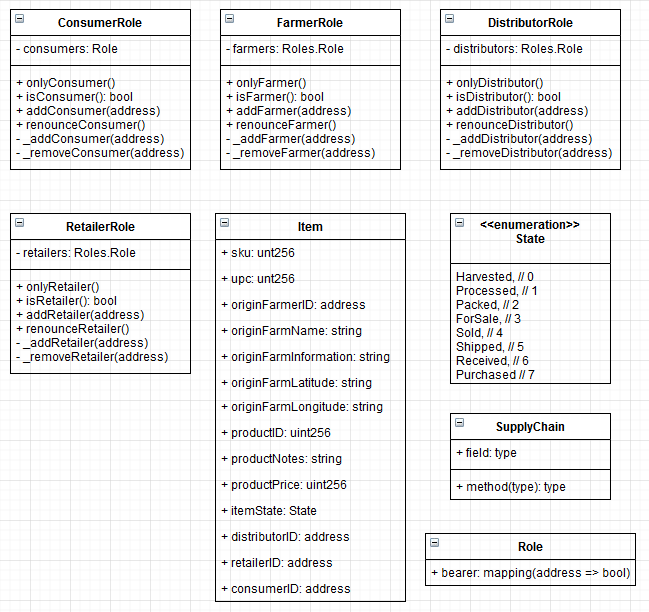
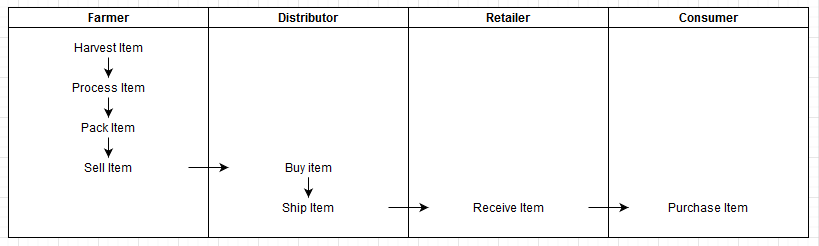
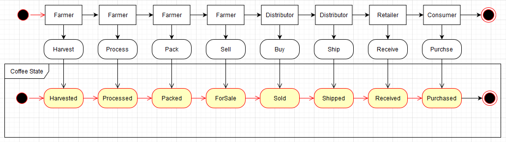

## UML

### Class Diagram

### Activity Diagram

### Sequence Diagram

### State Diagram

## Contract Addresses

SupplyChain

-   Tx Hash: 0x762b1866cf1970764e7d91cb1831d3e774b03b86de978d7dc4d7438611718aae
-   Contract Addr: 0x12730EA6A3BDbaec4193dc2b4a4c56A5b295c458

FarmerRole

-   Tx Hash: 0x06efa169bb09257ab999d9525882eb12c97577693b73fef16cf7ad7e1f2fbb13
-   Contract Addr: 0xD5a06db078bEcF2748304C6e88E880a02349Cf02

DistributorRole

-   Tx Hash: 0xe3a999e36f31e293a2e9accf3b3ea021c346add6eb5adb6f9039109310c741d7
-   Contract Addr: 0x0224ee89617e1bfF0cb500c89F789b91cB241dc8

RetailerRole

-   Tx Hash: 0xc2daf4738e8d3c45473b7e2ba033dd1fd931def8e86b700aedab4c0ba96de4d9
-   Contract Addr: 0x822d0aC84B2ef666ae2bd44E52ff9737a90aAaf7

ConsumerRole

-   Tx Hash: 0x575c2d96bf9129f198589fd64d49866758838bc2421e14eb1e185b8e60e5f712
-   Contract Addr: 0x83C0c062E7c787c588961435F6Ff373406679e9b

## Software Versions

-   Truffle v5.1.39 (core: 5.1.39)
-   Solidity v0.5.16 (solc-js)
-   Node v12.18.3
-   Web3.js v1.2.1
